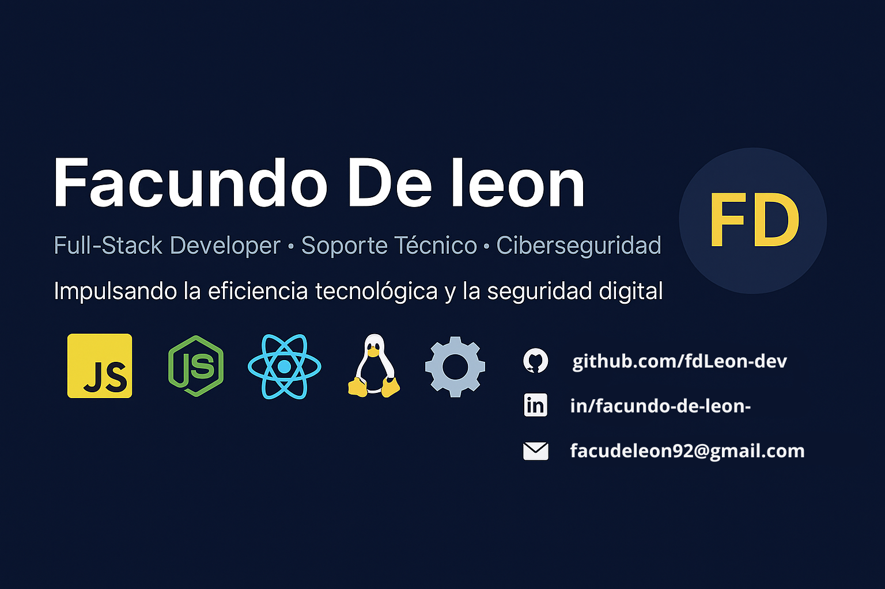

#  Hola, **soy**

> Creo interfaces limpias, soluciones prácticas y contenido técnico con foco en usabilidad y buenas prácticas.

---

##  Sobre mí

Soy desarrollador full-stack autodidacta con sólida experiencia en soporte técnico y optimización de sistemas. Me apasiona restaurar hardware, mejorar el rendimiento de equipos y fortalecer la seguridad informática mediante prácticas de ciberseguridad efectivas.

Trabajo con tecnologías modernas como React, Next.js, Node.js y TailwindCSS para crear soluciones web eficientes y escalables. Además, me gusta documentar procesos técnicos de forma clara para facilitar su comprensión y replicación.

>Disfruto documentar lo que hago para que otros puedan entenderlo y replicarlo fácilmente. Me enfoco en crear soluciones prácticas y fáciles de usar, y me encanta compartir lo que aprendo.

---

## 📍 Ubicación | 📫 Contacto

Montevideo, Uruguay

- ✉️ Email: [facudeleon92@gmail.com](mailto:facudeleon92@gmail.com)  
- 🐙 GitHub: [fdLeon-dev](https://github.com/fdLeon-dev)  
- 🔗 LinkedIn: [Facundo De leon](https://www.linkedin.com/in/facundo-de-leon-956279286/)  
- 📸 Instagram: [@devices_.f2](https://www.instagram.com/devices_.f2/)  
- 💬 Discord / Telegram: `#nvme8846`
---

## 🚀 Stack Principal

**HTML5**, **CSS3**, **JavaScript (ES6+)**, **React.js / Next.js**, **TailwindCSS**, **Node.js / Express.js**

---

## 🛠️ Habilidades

| Tecnología                         | Nivel             |
|----------------------------------|-------------------|
| HTML5 & Semántica                 | ⭐⭐⭐⭐⭐ Avanzado     |
| CSS3 (Flex/Grid, Animaciones)     | ⭐⭐⭐⭐⭐ Avanzado     |
| JavaScript (ES6+)                  | ⭐⭐⭐⭐⭐ Avanzado     |
| React.js / Next.js                 | ⭐⭐⭐ ⚝ ⚝ Intermedio |
| TailwindCSS                      | ⭐⭐⭐⚝ ⚝ Intermedio    |
| Node.js / Express.js               | ⭐⭐⭐⚝ ⚝ Intermedio     |
| APIs REST                         | ⭐⭐⚝ ⚝ ⚝ Básico-Intermedio    |
| Bases de datos SQL (PostgreSQL) | ⭐⭐⭐⚝ ⚝ Básico-Intermedio   |
| Bases de datos NoSQL (MongoDB)     | ⭐⭐⭐⚝ ⚝ Básico-Intermedio  |
| Autenticación (JWT, OAuth2)        | ⭐⭐⭐⭐⚝ Intermedio    |
| Docker (Contenedores)              | ⭐⭐⭐⚝ Básico-Intermedio |

---
## ¡Gracias por visitar mi perfil! 

Me gusta colaborar en proyectos interesantes y compartir lo que aprendo. Siempre busco nuevos retos para crecer profesionalmente y aportar valor con soluciones integrales y bien pensadas. 
>Si te interesa trabajar juntos, no dudes en contactarme. 🚀
